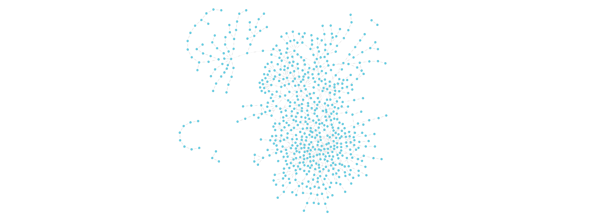

# Nobel Laureate Network

This repo reproduces parts of the analysis in the open access paper titled
[The Nobel family](https://link.springer.com/article/10.1007/s11192-024-04936-1), by Richard S. J. Tol.

The aim of this repo is twofold:

- Demonstrate how to use Kùzu to construct the graph and how to use NetworkX to analyze the data in it
- Enrich the graph with official metadata from the
[nobelprize.org](https://www.nobelprize.org/organization/developer-zone-2/) API. Because the names
in either dataset do not match exactly, entity resolution is needed -- this project uses the
[Senzing](https://senzing.com/docs/) API to resolve entities so that the data from these two sources
can be effectively merged to analyze the Nobel Laureate network.

## Data

The primary dataset for this project includes the tree structures that represents Nobel Laureates
between 1901 and 2022 and their mentors (dating back hundreds of years), generously made available
under the MIT license by the
original author (Richard S. J. Tol). The original data is available within MATLAB files in
[this repo](https://github.com/rtol/NobelNetwork), but is cleaned up and consolidated for ease of
reproducibility in this repo.

The secondary dataset that supplements the Nobel Laureate metadata is obtained from the
[nobelprize.org](https://www.nobelprize.org/organization/developer-zone-2/) API, available freely
under a Creative Commons Zero (CC0) license. If you use the data in this repo, please cite the
original source (nobelprize.org) as per their
[license terms](https://www.nobelprize.org/organization/terms-of-use-for-api-nobelprize-org-and-data-nobelprize-org/).

## Setup

Install the dependencies via `requirements.txt`.

```bash
pip install -r requirements.txt
```

## Construct Kùzu graph

The Kùzu graph is constructed using the script `build_kuzu_graph.py`.

```bash
$ python build_kuzu_graph.py

Created node table for Physics nobel prize
Created node table for Chemistry nobel prize
Created node table for Medicine nobel prize
Created node table for Economics nobel prize
Inserted scholars into the Scholar node table
Inserted relationships into the MENTORED relationship table
Inserted data into the WON_Scholar_Physics relationship table group
Inserted data into the WON_Scholar_Chemistry relationship table group
Inserted data into the WON_Scholar_Medicine relationship table group
Inserted data into the WON_Scholar_Economics relationship table group
```

The graph of Nobel laureates and their mentor relationships looks like this:



In total, there are 3,517 scholars who mentored modern Nobel laureates that date back hundreds of years!